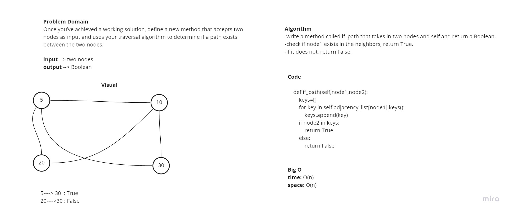

# Graphs

## Challenge
Implement your own Graph. The graph should be represented as an adjacency list

## API
`AddNode()`:
- Adds a new node to the graph
- Takes in the value of that node
- Returns the added node

`AddEdge()`:
- Adds a new edge between two nodes in the graph
- Include the ability to have a “weight”
- Takes in the two nodes to be connected by the edge
- Both nodes should already be in the Graph

`GetNodes()`:
- Returns all of the nodes in the graph as a collection (set, list, or similar)

`GetNeighbors()`:
- Returns a collection of edges connected to the given node
- Takes in a given node
- Include the weight of the connection in the returned collection

`Size()`
- Returns the total number of nodes in the graph

# Challenge Summary

## Challenge Description
Once you’ve achieved a working solution, define a new method that accepts two nodes as input and uses your traversal algorithm to determine if a path exists between the two nodes.

## Solution

