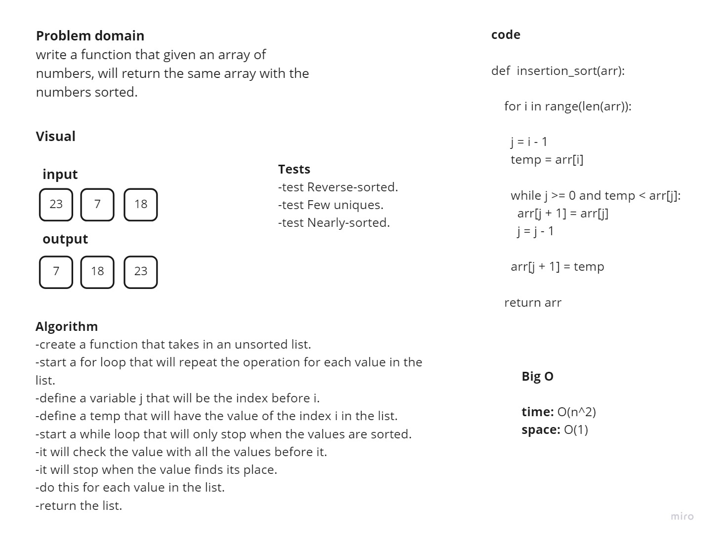

# Challenge Summary

## Challenge Description
write a function that given an array of numbers, will return the same array with the numbers sorted.

## Approach & Efficiency
time: O(n^2)
space: O(1)

## Solution

