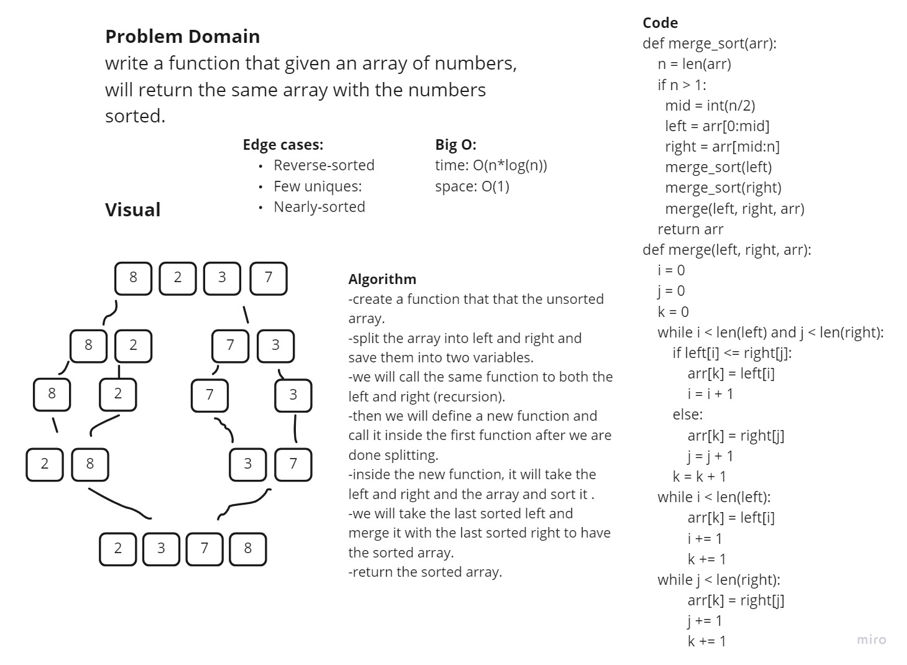

## THis is done by collaboration with Joudi

# Challenge Summary

## Challenge Description
write a function that given an array of numbers, will return the same array with the numbers sorted.

## Approach & Efficiency
Big O:

time: O(n*log(n))

space: O(1)

## Solution

